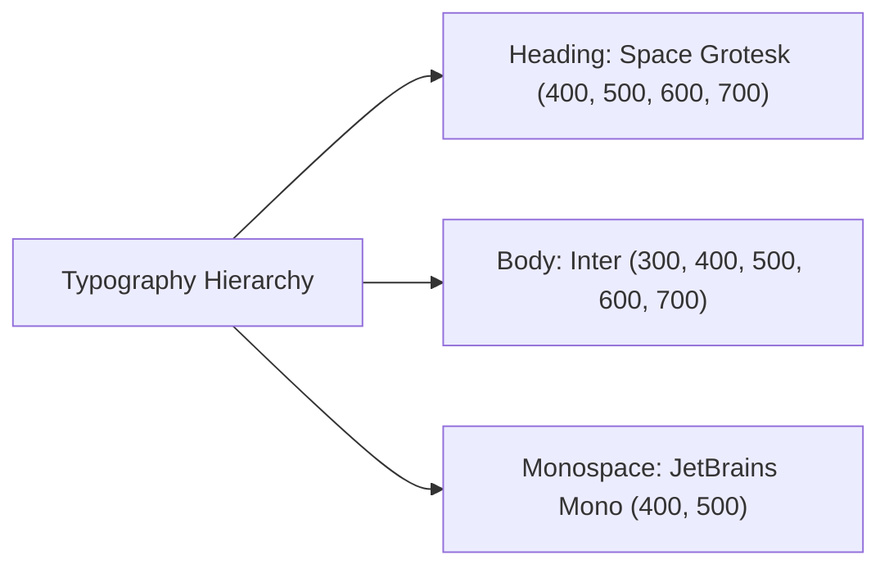

# Codebase Overview & Architecture Guide

**Project Name:** Vivyn Bhavani Raaman - Engineering Portfolio  
**Target Identity:** Mechanical & Aerospace Engineer Portfolio  
**Framework & Runtime:** Next.js 15 (App Router) + React 19 + TypeScript + Node.js  
**Styling & UI:** Tailwind CSS v4 + Radix UI (shadcn/ui New York style) + Lucide Icons + Framer Motion  
**Backend & Real-Time:** Custom Node HTTP Server (`server.ts`) + Socket.IO + Prisma ORM (SQLite)

---

## 1. Executive Summary

This repository is a modern, high-performance web portfolio for **Vivyn Bhavani Raaman**, a Mechanical and Aerospace Engineering student currently attending the **University of Connecticut (UConn)**, formerly at **Central Connecticut State University (CCSU)**. 

The website is engineered to present:
- **Major Engineering Projects**: Advanced CAD modeling (Siemens NX V12 engine), Vertical Axis Wind Turbine (VAWT) wind tunnel research, and Formula SAE racecar aerodynamic prototyping.
- **Academic Milestones**: Degree progress tracking (expected graduation May 2028), academic background, and future graduate school ambitions in propulsion and aerodynamics.
- **Professional Background**: Practical engineering experience, ASME collegiate involvement, CPR/AED and OSHA certifications.
- **Resume & Contact**: Embedded interactive PDF viewer and direct inquiries channel.

---

## 2. Design System: Color Palette, Typography & Badges

The portfolio features a high-tech, aerospace-inspired design language configured in `src/app/globals.css` using modern **OKLCH** color spaces, customized **Google Fonts**, and modular **Radix UI** primitives. The application is set to **Dark Mode by default** (`<html className="dark smooth-scroll">`).

### 2.1. Theme Color Palette (OKLCH Color Space)

The project leverages the **OKLCH** color format in Tailwind CSS v4, which ensures perceptually uniform lightness, chroma, and hue transitions. The predominant color temperature uses an aerospace cyan/slate hue (`hue: 220`).

#### Core Color Tokens

| Token Name | Light Mode Value | Dark Mode (Default) | Role & Visual Usage |
| :--- | :--- | :--- | :--- |
| `--background` | `oklch(1 0 0)` | `oklch(0.08 0.01 220)` | Deep slate-black canvas background |
| `--foreground` | `oklch(0.145 0 0)` | `oklch(0.95 0.01 220)` | High-contrast platinum text |
| `--card` | `oklch(1 0 0)` | `oklch(0.12 0.02 220)` | Elevated container surface background |
| `--card-foreground` | `oklch(0.145 0 0)` | `oklch(0.95 0.01 220)` | Text inside cards and containers |
| `--popover` | `oklch(1 0 0)` | `oklch(0.12 0.02 220)` | Floating modals, tooltips, dialogs |
| `--popover-foreground` | `oklch(0.145 0 0)` | `oklch(0.95 0.01 220)` | Content inside popovers and menus |
| `--primary` | `oklch(0.45 0.02 220)` | `oklch(0.85 0.02 220)` | Bright cyan/aero highlight, key buttons, links |
| `--primary-foreground`| `oklch(0.985 0 0)` | `oklch(0.08 0.01 220)` | High-contrast text on primary buttons |
| `--secondary` | `oklch(0.97 0 0)` | `oklch(0.16 0.01 220)` | Subdued badge chips, secondary action buttons |
| `--secondary-foreground`| `oklch(0.205 0 0)` | `oklch(0.95 0.01 220)` | Text inside secondary components |
| `--muted` | `oklch(0.97 0 0)` | `oklch(0.16 0.01 220)` | Subtle pill fills, background sections |
| `--muted-foreground` | `oklch(0.556 0 0)` | `oklch(0.65 0.01 220)` | Secondary metadata, dates, descriptions |
| `--accent` | `oklch(0.97 0 0)` | `oklch(0.16 0.01 220)` | Hover highlights and interactive accents |
| `--accent-foreground` | `oklch(0.205 0 0)` | `oklch(0.95 0.01 220)` | Foreground on hovered items |
| `--destructive` | `oklch(0.577 0.245 27.325)` | `oklch(0.704 0.191 22.216)` | Alerts, danger actions, error boundaries |
| `--border` | `oklch(0.922 0 0)` | `oklch(0.95 0.01 220 / 15%)` | Delicate 15% opacity card/section border lines |
| `--input` | `oklch(0.922 0 0)` | `oklch(0.95 0.01 220 / 20%)` | Input control border lines |
| `--ring` | `oklch(0.708 0 0)` | `oklch(0.85 0.02 220)` | Focus-visible ring glow color |

#### Chart & Data Visualization Palette

| Token | Dark Mode Value | Hue Description |
| :--- | :--- | :--- |
| `--chart-1` | `oklch(0.85 0.02 220)` | Primary Aerospace Cyan |
| `--chart-2` | `oklch(0.696 0.17 162.48)` | Electric Teal / Emerald |
| `--chart-3` | `oklch(0.769 0.188 70.08)` | Technical Amber / Gold |
| `--chart-4` | `oklch(0.627 0.265 303.9)` | Precision Purple / Violet |
| `--chart-5` | `oklch(0.645 0.246 16.439)` | Propulsion Coral / Orange-Red |

#### Corner Radii Scale

```css
--radius: 0.625rem;            /* Base: 10px */
--radius-sm: calc(10px - 4px); /* 6px */
--radius-md: calc(10px - 2px); /* 8px */
--radius-lg: 10px;             /* 10px */
--radius-xl: calc(10px + 4px); /* 14px */
```

---

### 2.2. Typography System

The typography architecture uses a clean trifecta of modern sans, geometric headings, and precision monospace fonts loaded from Google Fonts:



#### Font Definitions & CSS Variables

| Family Name | CSS Variable | Fallback Stack | Usage Area |
| :--- | :--- | :--- | :--- |
| **Space Grotesk** | `--font-heading` | `sans-serif` | All headings (`h1`, `h2`, `h3`, `h4`, `h5`, `h6`), section titles, card headers |
| **Inter** | `--font-geist-sans`, `--font-sans` | `sans-serif` | Main body copy, descriptions, lists, UI text, button labels |
| **JetBrains Mono** | `--font-geist-mono`, `--font-mono` | `monospace` | Code blocks, technical metrics, numeric badges, inline `code` |

#### Typography Scale & Application

| Hierarchy | Tailwind Classes | Sample Text / Location |
| :--- | :--- | :--- |
| **Display / Hero H1** | `text-4xl sm:text-5xl md:text-7xl font-bold leading-tight` | "Vivyn Bhavani Raaman" (Hero Section) |
| **Page Title H2** | `text-4xl md:text-5xl font-bold mb-4` | "About Me", "Education", "Projects" |
| **Section Header H3** | `text-3xl font-semibold mb-6` | "Work Experience", "Professional Overview" |
| **Card Title H4** | `text-xl md:text-2xl font-bold` | "V12 Engine Project", Degree Titles |
| **Subtitle / Lead** | `text-lg md:text-xl text-muted-foreground` | Hero subheadings, section intro text |
| **Body Paragraph** | `text-base md:text-lg text-muted-foreground leading-relaxed`| About narrative, project descriptions |
| **Micro / Caption** | `text-xs uppercase tracking-widest font-semibold` | Symmetrical certification badges |

---

### 2.3. Badge System & Styling Standards

The application uses an accessible badge system defined in `src/components/ui/badge.tsx` powered by `class-variance-authority` (cva), along with customized patterns:

#### Standard Badge Variants (`badge.tsx`)

| Variant | Styling Rules | Use Cases |
| :--- | :--- | :--- |
| `default` | `bg-primary text-primary-foreground hover:bg-primary/90` | Active statuses (e.g. "Current (Sophomore Year at UCONN)") |
| `secondary` | `bg-secondary text-secondary-foreground hover:bg-secondary/90` | Technology skills, CAD keywords, tool lists |
| `outline` | `border border-border text-foreground hover:bg-accent` | Project types (e.g. "CAD Design Project", "Technical Team") |
| `destructive` | `bg-destructive text-white hover:bg-destructive/90` | Urgent notices or system errors |

#### Custom Badge Patterns Used Across the Portfolio

1. **Hero Skill Badges** (`src/app/page.tsx`):
   - Combines `variant="secondary"` with leading Lucide icons:
   ```tsx
   <Badge variant="secondary" className="px-4 py-1.5 text-sm">
     <Wrench className="w-3 h-3 mr-1.5" /> Mechanical Engineering
   </Badge>
   ```
2. **Symmetrical Certification Badges** (`src/components/ExperienceAndSkillsSection.tsx`):
   - Polished uppercase tracking with subtle translucent primary tint:
   ```tsx
   <Badge 
     variant="secondary" 
     className="mb-4 px-4 py-1.5 text-xs uppercase tracking-widest font-semibold bg-primary/10 text-primary hover:bg-primary/15 border-0 flex items-center gap-2"
   >
     <Award className="w-3 h-3" />
     {honor.type}
   </Badge>
   ```
3. **Target Ambition Badges** (`src/components/EducationSection.tsx`):
   - Outline style with subtle primary border or dashed border:
   ```tsx
   <Badge variant="outline" className="text-sm py-1.5 px-4 border-primary/30 text-primary flex items-center gap-2">
     <Target className="w-3.5 h-3.5" /> M.S. in Aerospace Engineering
   </Badge>
   <Badge variant="outline" className="text-sm py-1.5 px-4 border-dashed border-muted-foreground/40 text-muted-foreground">
     Ph.D. (Potential)
   </Badge>
   ```

---

### 2.4. Custom Utility Classes & Visual Effects

Configured in `src/app/globals.css`:

- **`.text-gradient`**:
  ```css
  @apply bg-gradient-to-r from-primary via-primary/80 to-primary/60 bg-clip-text text-transparent;
  ```
  Applies a metallic cyan gradient to prominent headings and the brand mark.

- **`.card-hover`**:
  ```css
  @apply transition-all duration-300 hover:scale-[1.02] hover:shadow-lg hover:shadow-primary/10;
  ```
  Elevates cards with smooth scaling and a cyan glow on cursor hover.

- **`.section-padding`**:
  ```css
  @apply py-20 px-4 sm:px-6 lg:px-8;
  ```
  Standard responsive horizontal and vertical container padding.

- **`.container-max`**:
  ```css
  @apply max-w-7xl mx-auto;
  ```
  Constrains content width for optimal readability on ultra-wide displays.

- **`.bg-professional` & `.border-professional`**:
  Dark gradients and translucent borders designed specifically for engineering cards.

---

## 3. Technology Stack & Key Libraries

| Category | Technology | Description |
| :--- | :--- | :--- |
| **Core Framework** | Next.js 15.5+ | Modern React framework utilizing the App Router architecture |
| **Frontend Library** | React 19 | Latest React version with server & client component architecture |
| **Language** | TypeScript 5 | End-to-end static typing across components, configs, and server |
| **CSS & Styling** | Tailwind CSS v4 | Next-gen utility-first styling with OKLCH theme color variables |
| **UI Components** | Radix UI / shadcn/ui | Accessible, unstyled UI primitives configured in `new-york` style |
| **Icons & Media** | Lucide React | High-quality vector SVG icons |
| **Animations** | Framer Motion & CSS Animations | Micro-interactions, bounce effects, and lightbox transitions |
| **Custom Server** | Node.js `http` + `tsx` | Custom server running Next.js alongside Socket.IO |
| **WebSockets** | Socket.IO 4.8+ | Real-time WebSocket endpoint mounted at `/api/socketio` |
| **Database & ORM** | Prisma 6 + SQLite | Local SQLite database (`prisma/dev.db`) managed through Prisma ORM |

---

## 4. Complete Codebase Structure Tree

```
test-main/
├── .dockerignore                     # Docker build ignore rules
├── .gitignore                        # Git ignore patterns (node_modules, .next, logs, etc.)
├── CODEBASE_OVERVIEW.md              # Full architecture, design tokens & technical guide
├── README.md                         # Project documentation and quick-start instructions
├── components.json                   # shadcn/ui configuration (new-york style, Lucide icons)
├── eslint.config.mjs                 # Flat ESLint 9 configuration for Next.js and TypeScript
├── fsae_bg.png                       # Root banner asset for racecar project
├── next.config.ts                    # Next.js configuration with build optimization settings
├── next-env.d.ts                     # Next.js auto-generated TypeScript declarations
├── package.json                      # Dependency manifests, package versions, and npm scripts
├── package-lock.json                 # npm lockfile
├── pnpm-lock.yaml                    # pnpm lockfile
├── postcss.config.mjs                # PostCSS config for Tailwind v4 (@tailwindcss/postcss)
├── server.ts                         # Custom Node.js HTTP server integrating Next.js + Socket.IO
├── start_website.bat                 # One-click Windows launcher to start local server & browser
├── tailwind.config.ts                # Tailwind theme configuration and custom colors
├── tsconfig.json                     # TypeScript compiler configuration with path aliases (@/*)
│
├── prisma/                           # Database layer
│   ├── dev.db                        # SQLite database file
│   └── schema.prisma                 # Prisma schema definition (User and Post models)
│
├── public/                           # Static public media assets
│   ├── ETM-260 (brviv).pdf           # Siemens NX CAD project technical documentation
│   ├── ETM_BG.png                    # V12 Engine project card background
│   ├── VAWT_bg.png                   # Wind turbine card background
│   ├── etm-260-1.jpg to -5.jpg       # V12 Engine CAD renders & exploded view images
│   ├── etm-260-3.gif                 # Animated assembly GIF for V12 Engine CAD
│   ├── favicon.png                   # Site browser icon (32x32)
│   ├── fire.jpg                      # Visual asset
│   ├── fsae-1.jpg to -5.jpg          # Formula SAE wind tunnel and vehicle images
│   ├── fsae_bg.png                   # Formula SAE project card background
│   ├── home.png                      # Main hero section background image
│   ├── logo.png                      # Personal/brand logo
│   ├── resume.pdf                    # Embedded & downloadable resume document
│   ├── robots.txt                    # Search engine crawler permissions
│   ├── test.webp                     # Asset placeholder
│   ├── v12.mp4 / v12.MOV             # V12 engine CAD 3D animation video
│   └── vawt-wind-tunnel-1.jpg to -3  # Wind tunnel turbine testing photographs
│
└── src/                              # Source code directory
    ├── app/                          # Next.js App Router routes & layouts
    │   ├── favicon.ico               # Fallback root icon
    │   ├── globals.css               # Global CSS, theme variables (light/dark OKLCH), fonts
    │   ├── layout.tsx                # Root layout with fonts, Navigation, Toaster, SEO metadata
    │   ├── page.tsx                  # Home page (Hero, introduction, engineering bio)
    │   │
    │   ├── about/                    # About Page
    │   │   └── page.tsx              # Deep-dive biography, academic journey, career goals
    │   │
    │   ├── education/                # Education Page
    │   │   └── page.tsx              # Route rendering EducationSection component
    │   │
    │   ├── experience-skills/        # Experience & Skills Page
    │   │   └── page.tsx              # Route rendering ExperienceAndSkillsSection component
    │   │
    │   ├── projects/                 # Projects Showcase Page
    │   │   └── page.tsx              # Interactive cards, media gallery, and lightbox modal
    │   │
    │   ├── resume/                   # Resume Page
    │   │   └── page.tsx              # Interactive PDF embed iframe and download trigger
    │   │
    │   ├── contact/                  # Contact Page
    │   │   └── page.tsx              # Channels, response times, Google Form integration
    │   │
    │   └── api/                      # Backend API Route Handlers
    │       └── health/               # Health Check Route
    │           └── route.ts          # GET endpoint returning {"message": "Good!"}
    │
    ├── components/                   # React components
    │   ├── Navigation.tsx            # Sticky navigation bar with desktop & mobile drawer menu
    │   ├── EducationSection.tsx      # Degree timeline, live % progress bar, future goals
    │   ├── ExperienceAndSkillsSection.tsx # Job history, ASME activities, certifications
    │   │
    │   └── ui/                       # 48 shadcn/ui modular components
    │       ├── accordion.tsx         # Collapsible accordion item
    │       ├── alert-dialog.tsx      # Modal alert confirmation
    │       ├── alert.tsx             # Inline notification box
    │       ├── aspect-ratio.tsx      # Constrained aspect ratio container
    │       ├── avatar.tsx            # User avatar with fallback
    │       ├── badge.tsx             # Pill/tag badge component
    │       ├── breadcrumb.tsx        # Navigation breadcrumb path
    │       ├── button.tsx            # Button component with variants
    │       ├── calendar.tsx          # Date selection calendar
    │       ├── card.tsx              # Card container with Header, Content, Footer
    │       ├── carousel.tsx          # Slider/carousel via embla-carousel
    │       ├── chart.tsx             # Chart container wrapper for recharts
    │       ├── checkbox.tsx          # Form checkbox input
    │       ├── collapsible.tsx       # Expandable disclosure element
    │       ├── command.tsx           # Command palette menu (cmdk)
    │       ├── context-menu.tsx      # Right-click context menu
    │       ├── dialog.tsx            # Modal window
    │       ├── drawer.tsx            # Slide-in drawer (Vaul)
    │       ├── dropdown-menu.tsx     # Dropdown context menu
    │       ├── form.tsx              # React Hook Form integration wrapper
    │       ├── hover-card.tsx        # Popover on mouse hover
    │       ├── input-otp.tsx         # One-time passcode character inputs
    │       ├── input.tsx             # Text input field
    │       ├── label.tsx             # Form element label
    │       ├── menubar.tsx           # Application menubar
    │       ├── navigation-menu.tsx   # Multi-level navigation dropdowns
    │       ├── pagination.tsx        # Multi-page pagination bar
    │       ├── popover.tsx           # Floating popover box
    │       ├── progress.tsx          # Linear progress bar
    │       ├── radio-group.tsx       # Radio option list
    │       ├── resizable.tsx         # Resizable panel layouts
    │       ├── scroll-area.tsx       # Custom styled scrollbar container
    │       ├── select.tsx            # Dropdown select control
    │       ├── separator.tsx         # Visual horizontal/vertical divider
    │       ├── sheet.tsx             # Off-canvas side sheet
    │       ├── sidebar.tsx           # Responsive sidebar panel
    │       ├── skeleton.tsx          # Loading state placeholder
    │       ├── slider.tsx            # Range slider
    │       ├── sonner.tsx            # Sonner toast notifications
    │       ├── switch.tsx            # Toggle switch
    │       ├── table.tsx             # Styled HTML table
    │       ├── tabs.tsx              # Tab switcher
    │       ├── textarea.tsx          # Multi-line text field
    │       ├── toast.tsx             # Toast notification component
    │       ├── toaster.tsx           # Toast view renderer
    │       ├── toggle-group.tsx      # Group of selectable toggles
    │       ├── toggle.tsx            # Two-state toggle button
    │       └── tooltip.tsx           # Hover tooltip
    │
    ├── hooks/                        # Custom React Hooks
    │   ├── use-mobile.ts             # Detects mobile screen breakpoint (<768px)
    │   └── use-toast.ts              # Manages toast dispatching, timers, and state
    │
    └── lib/                          # Utility & Backend Library Files
        ├── db.ts                     # PrismaClient singleton instance for SQLite
        ├── socket.ts                 # Socket.IO connection handler & echo message listener
        └── utils.ts                  # `cn()` utility combining `clsx` and `tailwind-merge`
```

---

## 5. In-Depth Component & Route Documentation

### 5.1. Navigation (`src/components/Navigation.tsx`)
- **Desktop Bar**: Fixed at the top (`z-50`) with backdrop blur and transition effects when scrolling past `50px`.
- **Mobile Menu**: Responsive hamburger button that triggers an animated side drawer.
- **Route Links**: Includes links to Home (`/`), Education (`/education`), Experience & Skills (`/experience-skills`), Projects (`/projects`), Resume (`/resume`), and Contact (`/contact`).
- **Hydration Safety**: Uses a `mounted` state guard to avoid React hydration mismatches between server and client renders.

### 5.2. Home Page (`src/app/page.tsx`)
- **Hero Banner**: Full viewport background (`home.png`) with gradient vignette overlays.
- **Introductory Copy**: Highlights engineering focus (propulsion, wind tunnel testing, CAD design).
- **CTA Actions**: Buttons routing to `/contact` and `/projects`.
- **Story Card**: Narrative describing inspiration from high school mentor Mr. Buys, childhood RC car teardowns, DIY solid rocket motors, and pandemic foam model airplanes.

### 5.3. Projects Page (`src/app/projects/page.tsx`)
- **Showcase Items**:
  1. **V12 Engine Project**: Siemens NX 3D modeling and assembly design. Includes an interactive gallery with 5 images, an animated GIF, an MP4 video clip, and a direct link to the technical report PDF (`ETM-260 (brviv).pdf`).
  2. **VAWT Project Fellow**: Vertical Axis Wind Turbine engineering at CCSU, component integration, and wind tunnel performance measurements.
  3. **Formula SAE Aerodynamics Subsystem**: UConn team aerodynamics design, wind tunnel testing, and computational fluid dynamics (CFD).
- **Lightbox Modal**: Clickable gallery with keyboard navigation:
  - `ArrowRight`: Next media
  - `ArrowLeft`: Previous media
  - `Escape`: Close lightbox
  - Handles images, GIFs, and HTML5 video (`.mp4` / `.mov`).

### 5.4. Education Page (`src/components/EducationSection.tsx`)
- **Live Degree Progress**: Dynamically computes completion percentage between start date (`August 26, 2024`) and expected graduation date (`May 10, 2028`).
- **University Record**: Documents transition from freshman year at Central Connecticut State University to sophomore year at University of Connecticut.
- **Future Ambitions**: Details target goals for pursuing an M.S. and potential Ph.D. in Aerospace Engineering.

### 5.5. Experience & Skills Page (`src/components/ExperienceAndSkillsSection.tsx`)
- **Work Experience**: Demonstrates teamwork, time management, and customer relations from practical employment.
- **Extracurricular**: Active ASME membership, STEM outreach, and hands-on collegiate engineering workshops.
- **Honors & Certifications**:
  - *Excellence in Engineering* Award (Avon High School, 2024)
  - *Adult and Child CPR/AED* Certification (American Heart Association, 2023)
  - *OSHA Workplace Safety* Certification (In Progress)

### 5.6. Resume Page (`src/app/resume/page.tsx`)
- **Embedded PDF Viewer**: An iframe rendering `/resume.pdf` with standard browser PDF toolbar parameters.
- **Direct Download Button**: Instant download of `Vivyn_Bhavani_Raaman_Resume.pdf`.

### 5.7. Contact Page (`src/app/contact/page.tsx`)
- **Contact Details**: Location (Connecticut, USA) and LinkedIn link.
- **Inquiry Action**: Integrated button opening Google Forms for external message submission.
- **Status Badges**: Indicates active search for engineering internships and co-op opportunities.

### 5.8. Custom Server & WebSocket Layer (`server.ts` & `src/lib/socket.ts`)
- Configures a custom Node.js HTTP server that binds both Next.js request handling and Socket.IO on port `3000`.
- Socket.IO is attached to `/api/socketio` with CORS configured.
- Implements an echo communication handler and connection life-cycle logger.

---

## 6. How to Run the Website Locally

### Option 1: One-Click Windows Launcher (`start_website.bat`)
Simply **double-click** the `start_website.bat` file in the project folder:
1. It automatically verifies that **Node.js** is installed.
2. It detects and installs any missing `node_modules` automatically.
3. It generates the **Prisma client** if needed.
4. It starts the local server on `http://localhost:3000`.
5. It **automatically launches your default browser** directly to `http://localhost:3000`.

### Option 2: Command Line (pnpm / npm)

1. **Install dependencies**:
   ```bash
   pnpm install
   # or: npm install
   ```

2. **Generate the Prisma client**:
   ```bash
   npx prisma generate
   ```

3. **Start the application server**:
   ```bash
   npx tsx server.ts
   ```

4. **Access the website**:
   Open your browser and navigate to:
   ```
   http://localhost:3000
   ```

---

## 7. Build and Production Commands

- **Build Next.js for production**:
  ```bash
  pnpm run build
  # or: npm run build
  ```

- **Run in production mode**:
  ```bash
  pnpm run start
  # or: npm run start
  ```

- **Prisma Studio (Inspect SQLite DB UI)**:
  ```bash
  npx prisma studio
  ```
